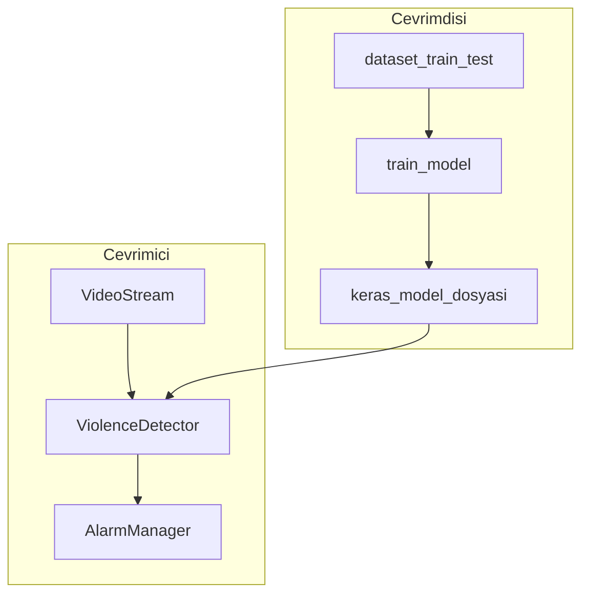

# 01 — Proje mimarisi

## Amaç

Görüntü veya video akışından **şiddet** ile **şiddet olmayan** sahneleri ayırt etmek. Çözüm, gerçek zamanlı görüntü işleme ve karar modeli ile desteklenen bir izleme sistemi olarak tasarlanır.

## Teknoloji yığını

| Alan | Kütüphane / araç | Kullanım yeri |
|------|------------------|---------------|
| Karar modeli | Kayıtlı görüntü analiz modeli | `violence_detector.py`, `main/test_model.py` |
| Görüntü I/O ve işleme | OpenCV (`cv2`) | Video akışı, BGR→RGB, yeniden boyutlandırma, MOG2 |
| Metrikler ve görselleştirme | scikit-learn, matplotlib, seaborn | Raporlar, confusion matrix, ROC |
| Arayüz ve rapor | tkinter, reportlab, sqlite3 (olay kaydı) | `main/violence_detection/` |

Tam bağımlılık listesi için depo kökündeki `requirements.txt` dosyasına bakın.

## Modül haritası

```
main/
├── train_model.py          # Eğitim: veri yükleyici, model, fine-tuning, raporlar
├── test_model.py           # Kayıtlı modeli test klasöründe değerlendirme
├── real_time_testing.py    # Webcam ile basit gerçek zamanlı deneme (tek dosya)
└── violence_detection/     # Paket: GUI, alarm, RTSP/webcam akışı, rapor
    ├── main.py             # Giriş noktası (argparse, GUI döngüsü)
    ├── config.py           # Sabitler (FPS, eşikler, model yolu)
    ├── video_stream.py     # Akış üretimi
    ├── violence_detector.py# MOG2 + model tahmini
    ├── alarm_manager.py    # Eşik, soğuma süresi, ses, ekran görüntüsü, SQLite
    ├── report_generator.py # PDF rapor
    └── detection_gui.py    # Tkinter arayüzü
```

## Model girişi ve çıktısı

- **Giriş**: RGB görüntü, uzamsal boyut **224×224**, piksel değerleri **[0, 1]** aralığına ölçeklenir (eğitimde `rescale=1./255`, çıkarımda `violence_detector.preprocess_frame` ile uyumlu).
- **Çıktı**: Tek logit sonrası **sigmoid**; olasılık **0–1** arası. İkili karar için varsayılan eşik **0.5** (`violence_detector.detect`).

## Mimari diyagram (mantıksal)



## İlgili belgeler

- Veri yapısı ve hazırlık gerekçeleri: [02-veri-hazirligi.md](02-veri-hazirligi.md)
- Eğitim aşamaları: [03-model-ve-egitim.md](03-model-ve-egitim.md)
