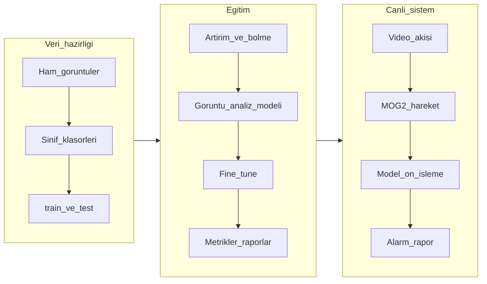

# Teknik dokümantasyon

Bu klasör, şiddet tespiti projesinin veri hazırlığından model eğitimine ve gerçek zamanlı kullanıma kadar aşamalarını Türkçe ve koda dayalı olarak açıklar.

## Okuma sırası

1. [01-proje-mimarisi.md](01-proje-mimarisi.md) — Bileşenler, teknoloji yığını, uçtan uca akış
2. [02-veri-hazirligi.md](02-veri-hazirligi.md) — Eğitim öncesi veri neden ve nasıl hazırlanır
3. [03-model-ve-egitim.md](03-model-ve-egitim.md) — Mimari, transfer öğrenme, eğitim stratejisi
4. [04-degerlendirme-ve-test.md](04-degerlendirme-ve-test.md) — Test seti, metrikler, eşikler
5. [05-gercek-zamanli-kullanim.md](05-gercek-zamanli-kullanim.md) — Canlı akış, ön işleme, model yolu

## Proje özeti (bir cümle)

Video karelerinde şiddet / şiddet değil ayrımı yapan bir görüntü analiz modeli kullanılır; gerçek zamanlı uygulamada hareket filtresi ve isteğe bağlı alarm/raporlama vardır.

## Depo içi hızlı bağlantılar

- Kurulum ve komutlar: [KURULUM.md](../KURULUM.md), [README.md](../README.md)
- Eğitim: `main/train_model.py`
- Test: `main/test_model.py`
- Canlı tespit paketi: `main/violence_detection/`

## Uçtan uca akış (özet)

## Model dosyası yolu (önemli)

Eğitim betiği varsayılan olarak proje köküne `violence_model_v4.keras` yazar; canlı uygulama `main/violence_detection/config.py` içinde `models/violence_model_v4.keras` bekler. Ayrıntı için [05-gercek-zamanli-kullanim.md](05-gercek-zamanli-kullanim.md) ve [03-model-ve-egitim.md](03-model-ve-egitim.md) bölümlerine bakın.
